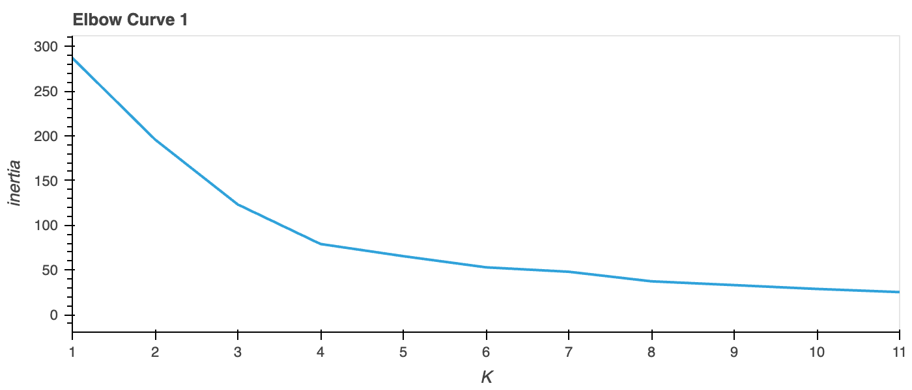
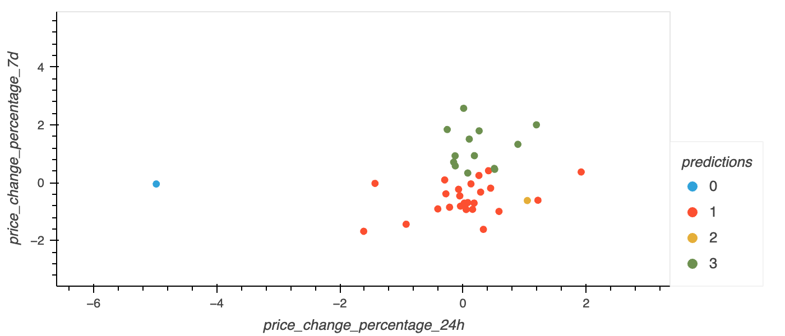
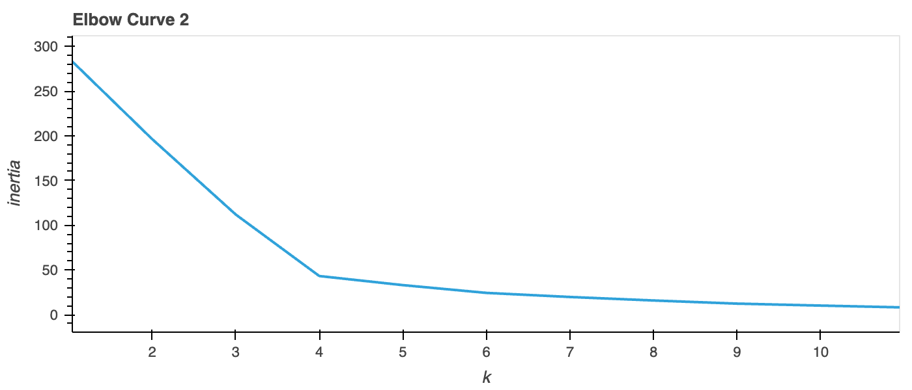
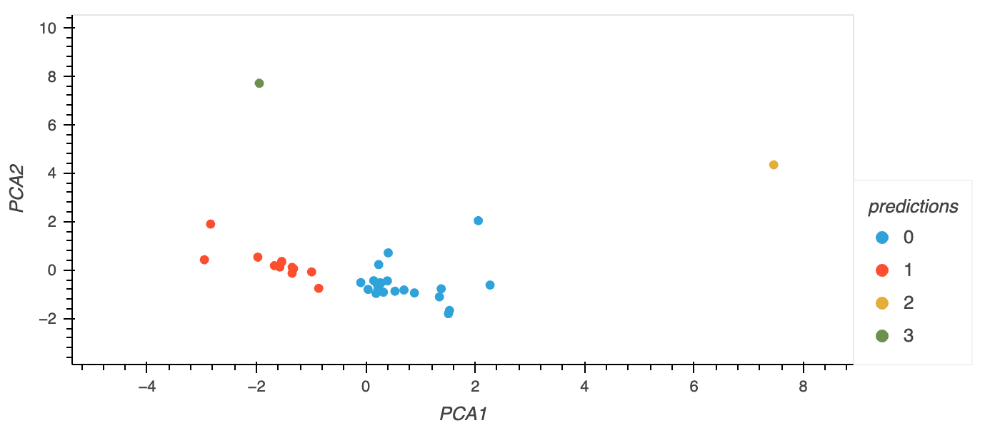

# Crypto Clustering Readme

### This repository contains the code for performing clustering analysis on cryptocurrency market data using K-means clustering and Principal Component Analysis (PCA). The purpose of this analysis is to group cryptocurrencies based on their price change percentages and identify patterns and similarities among them.

## Librarys

- import pandas as pd
- import hvplot.pandas
- from sklearn.cluster import KMeans
- from sklearn.decomposition import PCA
- from sklearn.preprocessing import StandardScaler
- import bokeh
---

- ***Optimal Number of Clusters:*** The optimal number of clusters (k) determined using the Elbow curve method was found to be 4. This value indicates that the data can be best clustered into four distinct groups.
- ***Original Data Clustering:*** Applying K-means clustering with k=4 on the original data resulted in well-defined clusters. The cryptocurrencies were grouped into four clusters based on their price change percentages, highlighting different performance patterns.
- ***Effect of PCA:*** Performing Principal Component Analysis (PCA) on the original data led to a reduction in dimensionality and capture of the most important features. The transformed data allowed for better visualization and interpretation of the clusters.
- ***Improved Cluster Separation:*** Clustering the PCA-transformed data using K-means with k=4 resulted in tighter clusters and improved separation between the groups. This indicates that the reduced-dimensional representation provided more meaningful insights into the similarities and differences among cryptocurrencies.
- ***Consistency in Optimal k:*** The optimal number of clusters (k=4) obtained from both the original data and PCA-transformed data was consistent. This suggests that the intrinsic structure of the data was well-captured, regardless of the dimensionality reduction.
- ***Visualization and Comparison:*** Various visualizations, such as scatter plots and line charts, were generated to compare the Elbow curves and the clustering results. These visualizations helped in understanding the clustering outcomes and identifying the impact of using PCA on the cluster formation.

---

---

---

